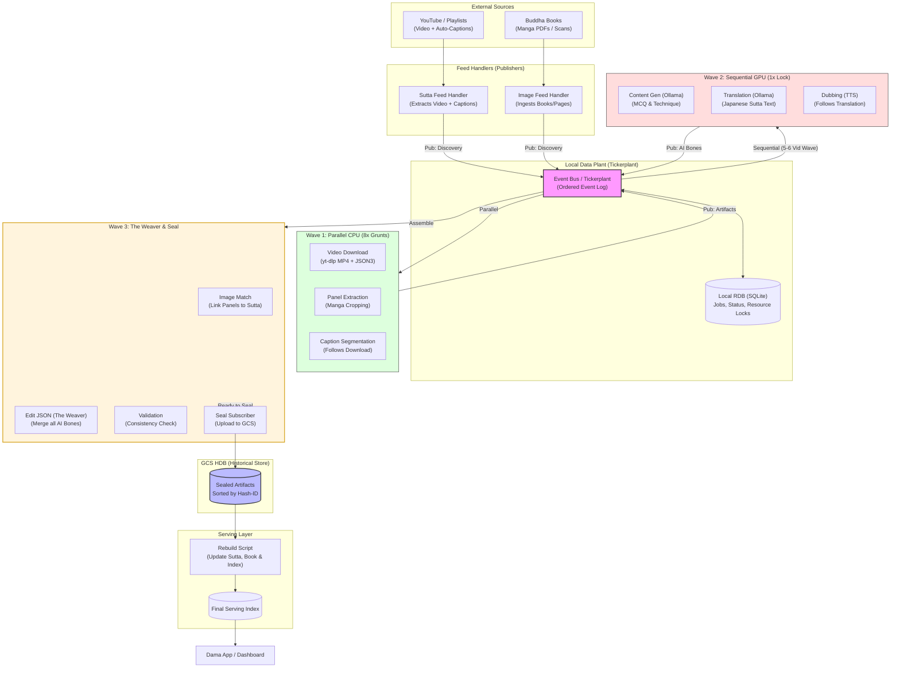

# Dama Data Plant Diagram

This is the editable architecture diagram for the local tickerplant-style data pipeline, optimized for **Factory Mode** (Batch processing for Books 1 & 2).

Core rule:
```text
Everything runs locally in optimized waves until a complete sutta is validated and sealed to GCS.
```

## System Diagram (Factory Mode)



## Compact Flow

```text
Discovery -> Wave 1 (CPU Parallel) -> Wave 2 (GPU Sequential) -> Wave 3 (Weaver) -> GCS Seal -> Rebuild
```

## The Wave Strategy (Ideal size: 5-6 Videos)

| Wave | Mode | Strategy |
|---|---|---|
| **Wave 1** | Parallel CPU | Prefetch videos and captions using 8 threads. Disk and Network intensive. |
| **Wave 2** | Sequential GPU | Load Ollama once. Process 5-6 videos back-to-back to avoid VRAM swapping. |
| **Wave 3** | Weaver | Assemble AI results, Manga panels, and Dubbed audio into the final Sutta JSON. |

## Golden Artifacts (Hash-ID)

Artifacts in GCS are indexed by **Hash-ID** (Content Hash + Model Version). 
- If the video content hasn't changed, the pipeline skips the expensive Wave 2.
- If the AI prompt is updated, only the affected AI artifacts are re-computed.
