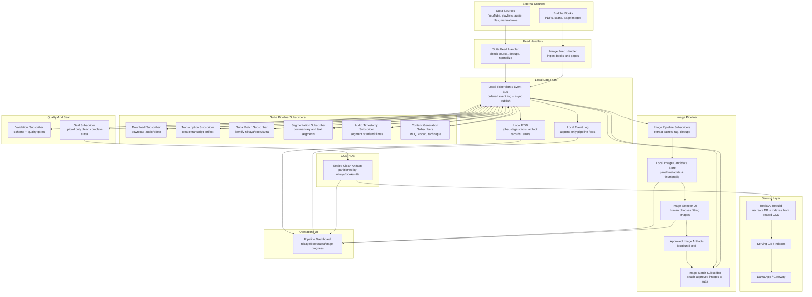

# Dama Data Plant Diagram

This is the editable architecture diagram for the local tickerplant-style data pipeline.

Core rule:

```text
Everything runs locally until a complete sutta is validated and sealed to GCS.
```

## System Diagram



## Compact Flow

```text
External sources
  -> feed handlers
  -> local tickerplant / event bus
  -> async subscribers
  -> local RDB + local artifacts
  -> validation
  -> seal complete sutta to GCS HDB
  -> replay/rebuild serving DB and indexes
  -> app, gateway, dashboard
```

## Local Versus GCS

| Zone | What Lives There | Rule |
|---|---|---|
| Local files | Raw downloads, transcripts, segments, image candidates, generated content | Mutable while work is in progress |
| Local RDB | Jobs, current stage status, artifact records, errors, review state | Operational state only |
| Local event log | Every pipeline fact emitted by feed handlers and subscribers | Append-only |
| GCS HDB | Clean sealed artifacts for completed suttas | Immutable canonical store |
| Serving DB / indexes | Queryable projection for the app | Rebuildable from GCS |

## Core Roles

| Role | Meaning |
|---|---|
| Feed handler | Validates and normalizes external inputs into first events |
| Tickerplant / event bus | Central local event spine; workers publish and subscribe through it |
| Publisher | Any process that emits an event |
| Subscriber | Any async worker that consumes events and emits new events |
| Local RDB | Current working state of the pipeline |
| GCS HDB | Sealed historical/canonical store |
| Replay / rebuild | Code path that recreates DB/indexes from sealed GCS artifacts |
| Gateway | Read/control layer used by app and dashboard |

## Main Sutta Artifacts

| Artifact | Produced By | Sealed To GCS |
|---|---|---:|
| Source manifest | Sutta feed handler | Yes |
| Audio file metadata | Download subscriber | Yes |
| Transcript | Transcription subscriber | Yes |
| Sutta match | Sutta match subscriber | Yes |
| Segments | Segmentation subscriber | Yes |
| Audio timestamps | Audio timestamp subscriber | Yes |
| MCQ | Content generation subscriber | Yes |
| Vocab | Content generation subscriber | Yes |
| Technique | Content generation subscriber | Yes |
| Images | Image match subscriber + selector UI | Yes |
| Seal manifest | Seal subscriber | Yes |

## Image Pipeline Detail

```text
Buddha books
  -> image feed handler
  -> panel extraction
  -> tagging/dedupe
  -> local candidate store
  -> image selector UI
  -> approved image artifacts
  -> image match subscriber
  -> sealed sutta image artifact in GCS
```

## Example Complete Sutta Seal

```text
gs://<bucket>/hdb/nikaya=AN/book=01/sutta=AN1.1/run=001/
  manifest.json
  source.json
  audio.json
  transcript.json
  sutta_match.json
  segments.json
  audio_timestamps.json
  mcq.json
  vocab.json
  technique.json
  images.json
```
