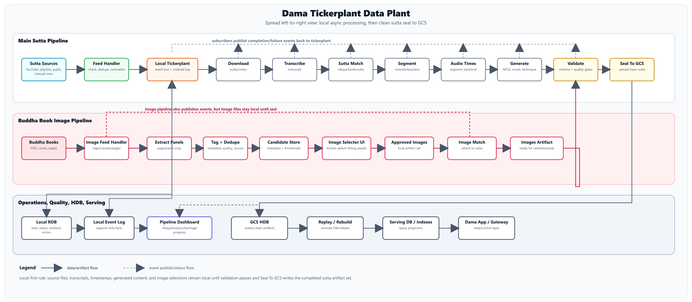

# Architecture

Docs2 architecture is based on the anchor diagram:



## One-Line Shape

```text
Local tickerplant-style data plant for sutta/audio/image processing, with GCS as the sealed historical store.
```

## System Flow

```text
Sutta sources
  -> sutta feed handler
  -> local tickerplant
  -> async sutta subscribers
  -> validation
  -> seal to GCS

Buddha books
  -> image feed handler
  -> image extraction/tagging/dedupe
  -> image selector UI
  -> approved image artifact
  -> image match subscriber
  -> validation
  -> seal to GCS
```

## Local-First Boundary

All processing is local until seal:

| Before Seal | After Seal |
|---|---|
| Raw audio/video downloads | Clean canonical artifacts in GCS |
| Raw transcripts | Manifest with checksums |
| Segments and timestamps | Serving DB/index rebuild input |
| Image candidates and selections | App-readable corpus artifacts |
| Generated MCQ/vocab/technique | Durable versioned history |
| Jobs, errors, review state | Rebuildable projections |

## Roles

| Role | Responsibility | Must Not Do |
|---|---|---|
| Sutta feed handler | Validate source inputs, dedupe, publish first source events | Transcribe, segment, generate, upload sealed data |
| Image feed handler | Register Buddha books/pages and publish image-source events | Pick final sutta images by itself |
| Tickerplant/event bus | Accept events, append to local event log, fan out to subscribers | Contain business logic for every stage |
| Local RDB | Track jobs, artifact records, status, errors, review state | Become the only copy of important data |
| Subscribers/workers | Consume events, do one stage, write artifact, publish result | Call downstream workers directly |
| Validation subscriber | Check schema, references, timestamps, completeness, quality gates | Seal invalid or incomplete data |
| Seal subscriber | Upload validated complete sutta artifacts to GCS | Upload messy work-in-progress data |
| GCS HDB | Store sealed canonical artifacts partitioned by nikaya/book/sutta | Be mutated in place after sealing |
| Replay/rebuild | Recreate DB and indexes from sealed GCS | Depend on local temporary state |
| Dashboard/gateway | Show/control plant status | Hide failed or pending states |

## Main Components

### External Sources

Sutta sources:

```text
YouTube videos
playlists
local audio/video files
manual source rows
existing corpus JSON
```

Image sources:

```text
Buddha books
PDFs
scans
page images
extracted panels
```

### Feed Handlers

Feed handlers turn messy outside inputs into clean first events.

Example:

```json
{
  "event_type": "source.sutta.discovered",
  "source_id": "youtube:abc123",
  "source_url": "https://youtube.com/watch?v=abc123",
  "nikaya": "AN",
  "book": "1",
  "sutta_hint": "AN1.1",
  "dedupe_key": "youtube:abc123"
}
```

### Local Tickerplant / Event Bus

The event bus is the center. Every worker talks through it.

```text
publisher emits event
  -> event appended to local log
  -> matching subscribers receive event async
  -> subscriber writes artifact
  -> subscriber publishes completion/failure event
```

### Async Subscribers

Subscribers move independently. They are connected by event types, not direct calls.

```text
audio.download.completed
  -> transcription subscriber
  -> dashboard
  -> local event log
```

### Local RDB

The local RDB is current working memory:

```text
jobs
stage_status
artifact_records
pipeline_errors
review_items
generation_runs
image_candidates
sealed_suttas
```

It is not the long-term source of truth.

### GCS HDB

GCS stores sealed clean artifact sets:

```text
gs://<bucket>/hdb/nikaya=AN/book=01/sutta=AN1.1/run=001/
  manifest.json
  source.json
  audio.json
  transcript.json
  sutta_match.json
  segments.json
  audio_timestamps.json
  mcq.json
  vocab.json
  technique.json
  images.json
```

### Replay / Rebuild

Replay means:

```text
read sealed GCS manifests
validate checksums and schemas
load artifacts
recreate local/serving DB rows
recreate indexes
verify counts
```

## Implementation Phases

| Phase | Goal | Transport |
|---:|---|---|
| 1 | Single local process, event-shaped code | In-memory/local DB queue |
| 2 | Local job table and event log | SQLite/Postgres/local files |
| 3 | Multiple local workers | Same local event bus |
| 4 | Cloud workers later | Pub/Sub or Cloud Tasks |

For Book 1 and Book 2, start local. The architecture should look like Pub/Sub, but it does not need real Pub/Sub yet.

